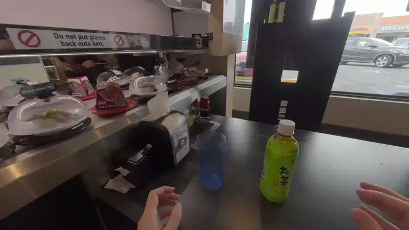
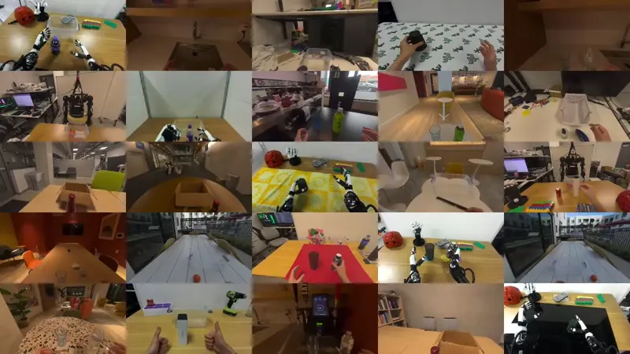
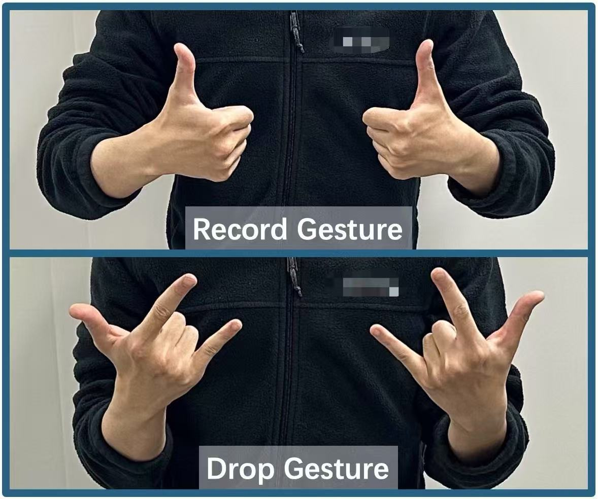
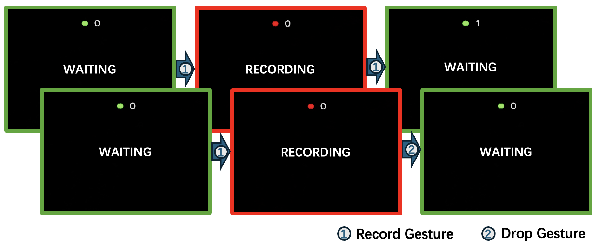

<h1 align="center">Humanoid Policy ~ Human Policy</h1>

<p align="center">
     &nbsp; &nbsp;
     &nbsp; &nbsp;
     &nbsp; &nbsp;
    
</p>

<p align="center">
<h3 align="center"><a href="https://human-as-robot.github.io/">Website</a> | <a href="https://arxiv.org/">arXiv</a> | <a href="https://huggingface.co/datasets/RogerQi/PH2D">Data</a> | <a href="https://docs.google.com/document/d/1Uv1rq5z7xdVqhdSUz7M4Yce71tjLqtkIqcCxfBlN5NI/edit?usp=sharing">Hardware</a>
  <div align="center"></div>
</p>

<p align="center">


</p>

## Introduction

This repository contains the codebase for the paper "Humanoid Policy ~ Human Policy".

It trains egocentric (i.e., without wrist camera) humanoid manipulation policies, with few wrappers to focus on the core components.

## Repo Structure

```
| - assets: robot URDFs and meshes
| - cet: Mujoco simulation for replaying/rollouting out policies for code development and adding new embodiments.
| - configs: configs for robots and simulation environments
| - data: placeholder for data with some visualization scripts
| - docs: documentations
| - hdt: main learning framework
| - human_data: script and interface for collecting human demonstration data
| - sim_test (legacy): legacy ALOHA cube transferring test as a dummy example for sanity check
```

## Supported Algorithms

- [x] ACT (with options to use ResNet, DinoV2, and CLIP backbones)
- [x] Vanilla DP (based on [official colab](https://colab.research.google.com/drive/18GIHeOQ5DyjMN8iIRZL2EKZ0745NLIpg?usp=sharing))
- [x] [RDT](https://github.com/thu-ml/RoboticsDiffusionTransformer) (Trainer works, but not tested)

## Setup dependency

Clone the codebase.

```bash
cd ~
git clone --recursive https://github.com/RogerQi/human-policy
```

Follow [INSTALL.md](./docs/INSTALL.md) to install required dependencies.

## Download open-sourced data

We open-source recordings on [HuggingFace](https://huggingface.co/datasets/RogerQi/PH2D):

- Many humans performing tasks described in the paper in diverse in-the-wild scenes.
- Two Unitree H1 humanoid robots physically located in UCSD and CMU. Collected via teleoperation.
- One Unitree H1 humanoid robot in Mujoco. Collected via teleoperation.

To download the data, run

```bash
cd data/recordings
bash download_data.sh
```

## Visualize downloaded data

We provide scripts to examine the actions and visual observations in downloaded data.

```bash
cd data/
# You can take a look at the argparse inside the script to change data path for visualization
python plot_keypoints.py
python plot_visual_obs.py
```

## Converting your own data to our human-centric representation format

Human data is a scalable source for manipulation policy learning and we believe humanoid policies should
make good use of it. To process your own human/humanoid data to our format, please refer to these files:

- [data/plot_keypoints.py](./data/plot_keypoints.py): 3D visualization of human-centric representations
- [docs/humanoid_mujoco.md](./docs/humanoid_mujoco.md): replay processed data in Mujoco to make sure representatiosn are well-aligned
- [hdt/constants.py](./hdt/constants.py): element-wise interpretation of human-centric representations in trainable formats

## Training

Let's take the toy humanoid manipulation data in Mujoco and simple ACT policy with ResNet as an example.
Other data/model options are available in [model configs](./hdt/configs/models/) and [dataset configs](./hdt/configs/datasets/).

To launch simple training on a single GPU (with at least 24GB VRAM), run

```bash
python main.py --chunk_size 100 --batch_size 64 --num_epochs 50000 --lr 1e-4 --seed 0 --exptid 'mujoco_sim_test_resnet_100cs' --dataset_json_path configs/datasets/mujoco_sim.json  --model_cfg_path configs/models/act_resnet.yaml --no_wandb
```

For more sophisticated training, such as BF16, torch.compile, or multi-GPU training, the training script supports huggingface accelerator.

Start by configuring a `config.yaml` file.

```bash
accelerate config --config_file ./accelerator_setup.yaml
```

Then

```bash
accelerate launch --config_file ./accelerator_setup.yaml  main.py --chunk_size 100 --batch_size 64 --num_epochs 50000 --lr 1e-4 --seed 0 --exptid 'mujoco_sim_test_resnet_100cs' --dataset_json_path configs/datasets/mujoco_sim.json  --model_cfg_path configs/models/act_resnet.yaml --no_wandb
```

For policies without complex architectures, such as ACT, we recommend using the `val_and_jit_trace` option to create traced models.

```bash
accelerate launch --config_file ./accelerator_setup.yaml  main.py --chunk_size 100 --batch_size 64 --num_epochs 50000 --lr 1e-4 --seed 0 --exptid 'mujoco_sim_test_resnet_100cs' --dataset_json_path configs/datasets/mujoco_sim.json  --model_cfg_path configs/models/act_resnet.yaml --no_wandb --val_and_jit_trace
```

By default, the main trainer uses `accelerator.load_state` to resume model/optimizer states from the latest checkpoint specified in `(exptid)`.
The `val_and_jit_trace` flag then skips the training loop, and uses data format in the training data loader to create a traced model in `(exptid)/policy_traced.pt`.

## (Virtual) Policy Rollout

Continuing from the previous example, after the policy is trained and traced, we can rollout the policy in Mujoco/real robot.
The needed components are the dataset statistics and the traced policy weights. We include an example command below, for complete
details please refer to [docs/humanoid_mujoco.md](./docs/humanoid_mujoco.md).

```bash
cd ../cet
python mujoco_rollout_replay.py  --hdf_file_path ../data/recordings/processed/1061new_sim_pepsi_grasp_h1_2_inspire-2025_02_11-22_20_48/processed_episode_0.hdf5 --norm_stats_path ../hdt/mujoco_sim_test_resnet_100cs/dataset_stats.pkl  --plot --model_path ../hdt/mujoco_sim_test_resnet_100cs/policy_traced.pt  --tasktype pepsi --chunk_size 100 --policy_config_path ../hdt/configs/models/act_resnet.yaml
```

## Human Data Collection Guide

After setting up the **ZED camera mount** following our [hardware documentation](https://docs.google.com/document/d/1Uv1rq5z7xdVqhdSUz7M4Yce71tjLqtkIqcCxfBlN5NI/edit?usp=sharing), you can start collecting human data.

### Step 1: Install Dependencies

First, initialize and update the [opentv](https://robot-tv.github.io/) submodule:

```bash
git submodule update --init --recursive
```

Then follow the [README](./human_data/opentv/README.md) to complete the environment setup.

---

### Step 2: Collect Human Data

Run the following command to start the data collection process:

```bash
cd ./human_data
python human_data.py --des task_name --description "description of the task"
```

- `--des`: A short name for the task (e.g., `pouring`, `cutting`)
- `--description`: A more detailed description of the task

---

### Gesture-Based Control

We use simple hand gestures to control the data collection flow:

<p align="center">
  
</p>

- **Record Gesture**: Start and stop recording a demonstration.
- **Drop Gesture**: Cancel the current recording.

---

### Recording Pipeline

The following diagram shows the internal state transitions during the data collection process:

<p align="center">
  
</p>

1. Use the **Record Gesture** to enter and exit the `RECORDING` state.
2. Use the **Drop Gesture** to cancel the current gesture and return to `WAITING`.

---

## TODOs

- [ ] Add teleoperation scripts to collect more Mujoco data
- [ ] Alleviate the known 'sticky finger' friction issue in Mujoco sim rollout
- [ ] Add example for forward kinematrics / retargeting for a new humanoid
